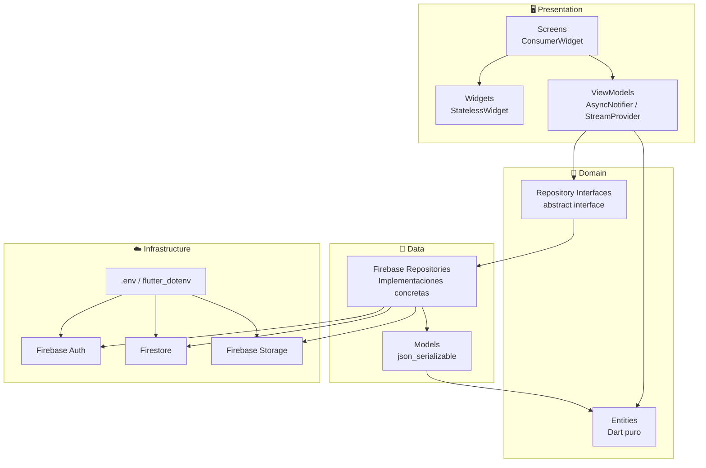
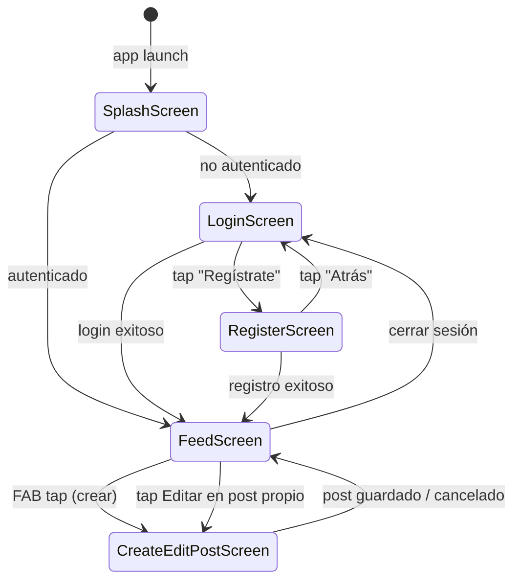
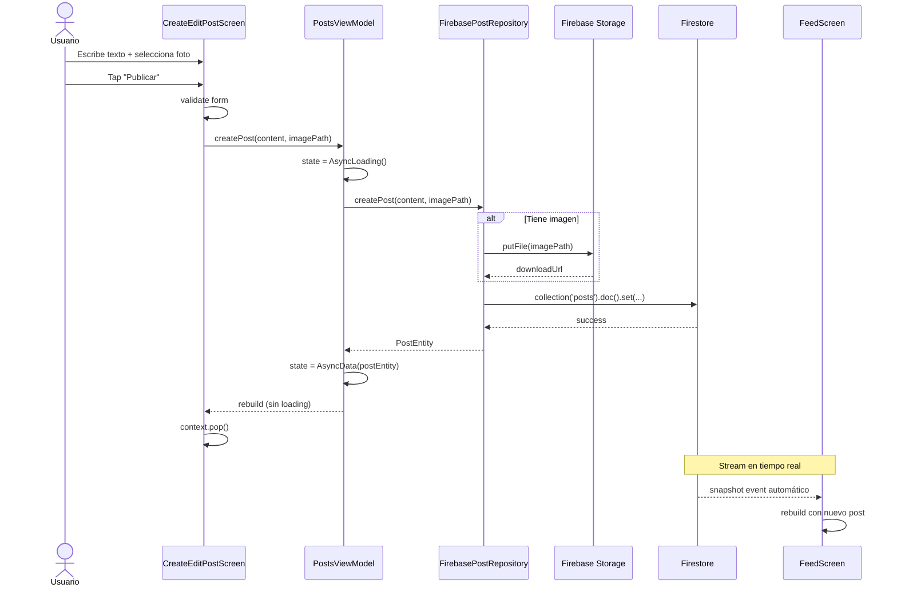
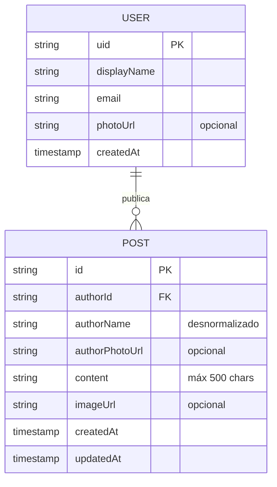
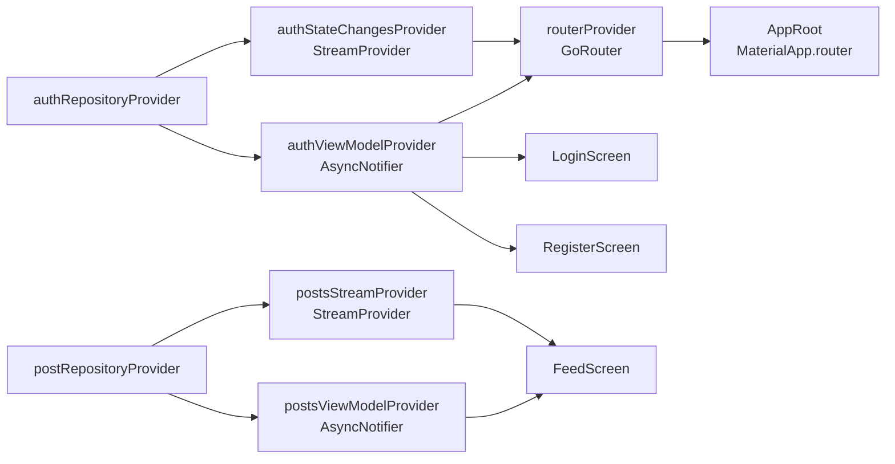

# Community Wall 🧱

> **Micro-blogging educativo** con Flutter + Firebase — arquitectura MVVM, Riverpod, GoRouter y Reglas de Seguridad.

Una app estilo Twitter/X extremadamente simplificada que enseña los conceptos clave de desarrollo móvil con Firebase: autenticación, CRUD en tiempo real, subida de imágenes y seguridad a nivel base de datos.

---

## Tabla de contenidos

- [Características](#características)
- [Arquitectura](#arquitectura)
- [Estructura del proyecto](#estructura-del-proyecto)
- [Dependencias](#dependencias)
- [Configuración y Setup](#configuración-y-setup)
- [Flujo de navegación](#flujo-de-navegación)
- [Flujo de datos](#flujo-de-datos)
- [Entidades y modelo de datos](#entidades-y-modelo-de-datos)
- [Grafo de providers](#grafo-de-providers)
- [Firebase — Reglas de Seguridad](#firebase--reglas-de-seguridad)
- [Supabase — Equivalente educativo](#supabase--equivalente-educativo)
- [Variables de entorno](#variables-de-entorno)
- [Generación de código](#generación-de-código)

---

## Características

| Feature | Descripción |
|---|---|
| **Auth** | Registro e inicio de sesión con Email/Password |
| **Feed en tiempo real** | Posts actualizados automáticamente vía Firestore streams |
| **Crear post** | Texto (máx 500 chars) + foto opcional de galería |
| **Editar post** | Solo el autor puede editar su propio post |
| **Eliminar post** | Solo el autor puede eliminar su propio post |
| **Seguridad** | Las reglas de Firestore/Storage impiden operaciones no autorizadas |
| **UI profesional** | Animaciones (fade, slide, shimmer), Material Design 3, dark mode |

---

## Arquitectura

La app sigue el patrón **MVVM** (Model-View-ViewModel) dividido en capas con responsabilidades claras:



**Principio clave:** Las capas superiores solo dependen de las interfaces (Domain), nunca de las implementaciones (Firebase). Esto permite intercambiar Firebase por Supabase sin tocar ViewModels ni Screens.

---

## Estructura del proyecto

```
lib/
├── core/
│   ├── config/
│   │   └── env.dart              # Lee variables de .env, construye FirebaseOptions
│   ├── constants/
│   │   └── app_constants.dart    # Nombres de colecciones, rutas Storage, límites
│   ├── errors/
│   │   └── app_exception.dart    # Sealed class: AuthException, PostException, etc.
│   ├── router/
│   │   └── app_router.dart       # GoRouter provider con guards de autenticación
│   └── theme/
│       └── app_theme.dart        # Tema Material 3 (light + dark)
├── domain/
│   ├── entities/
│   │   ├── user_entity.dart      # Objeto de negocio puro (sin deps de Firebase)
│   │   └── post_entity.dart      # isOwnedBy(), copyWith()
│   └── repositories/
│       ├── i_auth_repository.dart   # Contrato de autenticación
│       └── i_post_repository.dart   # Contrato de posts (Stream + CRUD)
├── data/
│   ├── models/
│   │   ├── user_model.dart       # Serialización JSON, fromFirestore(), toEntity()
│   │   └── post_model.dart       # toFirestoreCreate(), toFirestoreUpdate()
│   └── repositories/
│       ├── firebase_auth_repository.dart  # Implementa IAuthRepository + mapeo errores
│       └── firebase_post_repository.dart  # Implementa IPostRepository + Storage
├── presentation/
│   ├── viewmodels/
│   │   ├── auth_viewmodel.dart   # AsyncNotifier<UserEntity?> + authStateChangesProvider
│   │   └── posts_viewmodel.dart  # postsStreamProvider + PostsViewModel
│   ├── screens/
│   │   ├── splash/splash_screen.dart          # Fade + Scale animation
│   │   ├── auth/login_screen.dart             # Slide-up form
│   │   ├── auth/register_screen.dart          # 4 campos + confirmación password
│   │   ├── feed/feed_screen.dart              # Feed real-time + shimmer
│   │   └── post/create_edit_post_screen.dart  # Crear/editar + image picker
│   └── widgets/
│       ├── post_card.dart        # Card con menú owner (edit/delete)
│       ├── post_shimmer.dart     # Skeleton de carga
│       └── app_text_field.dart   # TextFormField reutilizable + Validators
└── main.dart                     # dotenv → Firebase.init → ProviderScope
```

---

## Dependencias

| Paquete | Versión | Propósito |
|---|---|---|
| `firebase_core` | ^3.13.1 | Inicialización de Firebase |
| `firebase_auth` | ^5.5.4 | Autenticación Email/Password |
| `cloud_firestore` | ^5.6.9 | Base de datos NoSQL en tiempo real |
| `firebase_storage` | ^12.4.6 | Almacenamiento de imágenes |
| `flutter_riverpod` | ^2.6.1 | State management (ProviderScope, ConsumerWidget) |
| `riverpod_annotation` | ^2.6.1 | Anotaciones `@riverpod` para code gen |
| `go_router` | ^15.1.2 | Navegación declarativa con guards |
| `flutter_dotenv` | ^5.2.1 | Variables de entorno desde `.env` |
| `json_annotation` | ^4.9.0 | Anotaciones `@JsonSerializable` |
| `image_picker` | ^1.1.2 | Selección de fotos de galería/cámara |
| `cached_network_image` | ^3.4.1 | Caché de imágenes de red |
| `shimmer` | ^3.0.0 | Efecto shimmer para estados de carga |
| `intl` | ^0.20.2 | Formato de fechas localizado |
| `build_runner` | ^2.4.15 | Ejecutor de generadores de código |
| `riverpod_generator` | ^2.6.3 | Genera providers desde `@riverpod` |
| `json_serializable` | ^6.9.5 | Genera `fromJson`/`toJson` |
| `custom_lint` | ^0.7.5 | Linting personalizado |
| `riverpod_lint` | ^2.6.3 | Reglas de lint específicas de Riverpod |

Si deseas instalar las dependencias desde la terminal puedes usar este comando 
flutter pub add firebase_core firebase_auth cloud_firestore firebase_storage flutter_riverpod riverpod_annotation go_router flutter_dotenv json_annotation image_picker cached_network_image shimmer intl

Dependencias de desarrollo
flutter pub add -d build_runner riverpod_generator json_serializable custom_lint riverpod_lint
---

## Configuración y Setup

### Prerequisitos

- Flutter SDK ≥ 3.18
- Cuenta de Firebase (plan Spark funciona para Auth + Firestore; plan Blaze para Storage)
- FlutterFire CLI: `dart pub global activate flutterfire_cli`

### Pasos

**1. Clonar el repositorio**
```bash
git clone <repo-url>
cd app-with-firebase-example
```

**2. Crear proyecto Firebase**

- Ir a [Firebase Console](https://console.firebase.google.com/)
- Crear nuevo proyecto
- Habilitar **Authentication → Email/Password**
- Crear base de datos **Firestore** (modo producción)
- Habilitar **Storage**

**3. Configurar Firebase en el proyecto**

```bash
flutterfire configure
```

Esto genera `google-services.json` (Android) y `GoogleService-Info.plist` (iOS).  
Mueve los archivos a sus ubicaciones:
- Android: `android/app/google-services.json`
- iOS: `ios/Runner/GoogleService-Info.plist`

> ⚠️ Ambos archivos están en `.gitignore` — nunca los subas a git.

**4. Configurar variables de entorno**
```bash
cp .env.example .env
```

Edita `.env` con los valores de tu proyecto (Firebase Console → Configuración del proyecto → Tus apps):
```env
FIREBASE_API_KEY=AIzaSy...
FIREBASE_APP_ID=1:000000000000:android:...
FIREBASE_MESSAGING_SENDER_ID=000000000000
FIREBASE_PROJECT_ID=tu-proyecto-id
FIREBASE_STORAGE_BUCKET=tu-proyecto-id.firebasestorage.app
FIREBASE_AUTH_DOMAIN=tu-proyecto-id.firebaseapp.com
```

**5. Instalar dependencias**
```bash
flutter pub get
```

**6. Generar código**
```bash
dart run build_runner build --delete-conflicting-outputs
```

**7. Publicar reglas de seguridad**

En Firebase Console, copia las reglas de las secciones [Firestore](#firestore-rules) y [Storage](#storage-rules) a continuación.

**8. Ejecutar la app**
```bash
flutter run
```

---

## Flujo de navegación



**Guard de autenticación (GoRouter):**
- Usuario no autenticado intentando acceder a `/feed` → redirige a `/login`
- Usuario autenticado intentando acceder a `/login` → redirige a `/feed`
- El guard se reevalúa automáticamente en cada cambio de sesión Firebase

---

## Flujo de datos

### Crear un post con imagen



---

## Entidades y modelo de datos



**¿Por qué `authorName` está desnormalizado en el post?**  
En Firestore no hay JOINs. Al guardar el nombre del autor en el documento del post, la lectura del feed requiere una sola query. El trade-off es que si el usuario cambia su nombre, los posts antiguos mantienen el nombre anterior.

### Estructura Firestore

```
/users/{userId}
  uid:          string
  displayName:  string
  email:        string
  photoUrl:     string | null
  createdAt:    Timestamp

/posts/{postId}
  authorId:       string  ← referencia al uid del usuario
  authorName:     string
  authorPhotoUrl: string | null
  content:        string (1–500 chars)
  imageUrl:       string | null
  createdAt:      Timestamp
  updatedAt:      Timestamp
```

**Firebase Storage:**
```
/posts/{userId}/{timestamp}.jpg
```

---

## Grafo de providers



**Separación reads/writes:** `postsStreamProvider` es solo lectura (stream en tiempo real). `postsViewModelProvider` es solo escritura (CRUD). La FeedScreen no se reconstruye cuando ocurre una mutación — solo cuando Firestore emite nuevos datos.

---

## Firebase — Reglas de Seguridad

### Firestore Rules

Publica estas reglas en Firebase Console → Firestore → Reglas:

```javascript
rules_version = '2';
service cloud.firestore {
  match /databases/{database}/documents {

    // ── Helpers ──────────────────────────────────────────────────────────────

    // isSignedIn: true si la request viene de un usuario autenticado.
    // request.auth es null para requests sin sesión → devuelve false automáticamente.
    function isSignedIn() {
      return request.auth != null;
    }

    // isOwner: true si el UID autenticado coincide con el campo userId.
    // Garantiza que el Usuario A no pueda modificar datos del Usuario B.
    function isOwner(userId) {
      return isSignedIn() && request.auth.uid == userId;
    }

    // isValidContent: el contenido debe ser string no vacío de máx 500 chars.
    // Esta validación ocurre en el servidor — no puede ser bypasseada desde el cliente.
    function isValidContent() {
      return request.resource.data.content is string
          && request.resource.data.content.size() > 0
          && request.resource.data.content.size() <= 500;
    }

    // ── /users/{userId} ──────────────────────────────────────────────────────
    match /users/{userId} {
      // Solo el propio usuario puede leer/crear/actualizar su perfil
      allow read:   if isOwner(userId);
      allow create: if isOwner(userId);
      // No puede cambiar su propio uid (campo inmutable)
      allow update: if isOwner(userId)
          && !('uid' in request.resource.data.diff(resource.data).affectedKeys());
      allow delete: if false; // Eliminar cuenta requiere flujo especial
    }

    // ── /posts/{postId} ──────────────────────────────────────────────────────
    match /posts/{postId} {
      // Cualquier usuario autenticado puede leer el feed público
      allow read: if isSignedIn();

      // Crear: el authorId en el documento DEBE coincidir con el UID del solicitante.
      // Sin esto, un usuario podría publicar haciéndose pasar por otro.
      allow create: if isSignedIn()
          && isValidContent()
          && request.resource.data.authorId == request.auth.uid;

      // Actualizar: solo el autor original puede editar.
      // authorId y createdAt son inmutables tras la creación.
      allow update: if isOwner(resource.data.authorId)
          && isValidContent()
          && !('authorId' in request.resource.data.diff(resource.data).affectedKeys())
          && !('createdAt' in request.resource.data.diff(resource.data).affectedKeys());

      // Eliminar: solo el autor puede borrar su post
      allow delete: if isOwner(resource.data.authorId);
    }
  }
}
```

### Storage Rules

```javascript
rules_version = '2';
service firebase.storage {
  match /b/{bucket}/o {

    // ── /posts/{userId}/{filename} ────────────────────────────────────────────
    // El userId en la ruta actúa como control de acceso:
    // solo el usuario dueño de esa carpeta puede escribir ahí.
    match /posts/{userId}/{filename} {
      // Cualquier usuario autenticado puede ver las imágenes del feed
      allow read: if request.auth != null;

      // Subir: el UID del solicitante debe coincidir con el userId de la ruta.
      // Además validamos tamaño (≤5 MB) y tipo MIME para evitar archivos maliciosos.
      allow write: if request.auth != null
          && request.auth.uid == userId
          && request.resource.size <= 5 * 1024 * 1024
          && request.resource.contentType.matches('image/.*');

      // Eliminar: solo el dueño puede borrar sus imágenes
      allow delete: if request.auth != null
          && request.auth.uid == userId;
    }
  }
}
```

---

## Supabase — Equivalente educativo

> Esta app usa **Firebase**. El SQL siguiente es solo para comparar conceptos entre Firebase y Supabase.

### Tablas equivalentes

```sql
-- Extensión UUID para IDs únicos
CREATE EXTENSION IF NOT EXISTS "uuid-ossp";

-- Tabla de perfiles (equivale a /users/{userId} en Firestore)
-- Referencia a auth.users de Supabase Auth (similar a Firebase Auth)
CREATE TABLE public.profiles (
  id           UUID PRIMARY KEY REFERENCES auth.users(id) ON DELETE CASCADE,
  display_name TEXT NOT NULL CHECK (char_length(display_name) >= 2),
  email        TEXT NOT NULL UNIQUE,
  photo_url    TEXT,
  created_at   TIMESTAMPTZ NOT NULL DEFAULT NOW()
);

-- Tabla de posts (equivale a /posts/{postId} en Firestore)
CREATE TABLE public.posts (
  id               UUID PRIMARY KEY DEFAULT uuid_generate_v4(),
  author_id        UUID NOT NULL REFERENCES public.profiles(id) ON DELETE CASCADE,
  author_name      TEXT NOT NULL,
  author_photo_url TEXT,
  content          TEXT NOT NULL CHECK (char_length(content) BETWEEN 1 AND 500),
  image_url        TEXT,
  created_at       TIMESTAMPTZ NOT NULL DEFAULT NOW(),
  updated_at       TIMESTAMPTZ NOT NULL DEFAULT NOW()
);

-- Índice para el query del feed (ordenado por fecha DESC)
CREATE INDEX posts_created_at_idx ON public.posts (created_at DESC);
```

### Row Level Security (equivale a Firestore Security Rules)

```sql
ALTER TABLE public.profiles ENABLE ROW LEVEL SECURITY;
ALTER TABLE public.posts    ENABLE ROW LEVEL SECURITY;

-- Perfil: cada usuario solo ve/modifica el suyo
CREATE POLICY "Leer perfil propio"
  ON public.profiles FOR SELECT USING (auth.uid() = id);

CREATE POLICY "Crear perfil propio"
  ON public.profiles FOR INSERT WITH CHECK (auth.uid() = id);

CREATE POLICY "Actualizar perfil propio"
  ON public.profiles FOR UPDATE
  USING (auth.uid() = id) WITH CHECK (auth.uid() = id);

-- Posts: todos los autenticados pueden leer
CREATE POLICY "Leer posts"
  ON public.posts FOR SELECT TO authenticated USING (true);

-- Posts: solo el autor puede crear (y el authorId debe ser su uid)
CREATE POLICY "Crear post propio"
  ON public.posts FOR INSERT TO authenticated
  WITH CHECK (auth.uid() = author_id);

-- Posts: solo el autor puede editar
CREATE POLICY "Editar post propio"
  ON public.posts FOR UPDATE TO authenticated
  USING (auth.uid() = author_id) WITH CHECK (auth.uid() = author_id);

-- Posts: solo el autor puede eliminar
CREATE POLICY "Eliminar post propio"
  ON public.posts FOR DELETE TO authenticated
  USING (auth.uid() = author_id);

-- Trigger para actualizar updated_at automáticamente
CREATE OR REPLACE FUNCTION update_updated_at()
RETURNS TRIGGER AS $$
BEGIN NEW.updated_at = NOW(); RETURN NEW; END;
$$ LANGUAGE plpgsql;

CREATE TRIGGER posts_updated_at
  BEFORE UPDATE ON public.posts
  FOR EACH ROW EXECUTE FUNCTION update_updated_at();
```

### Tabla comparativa Firebase ↔ Supabase

| Concepto | Firebase | Supabase |
|---|---|---|
| Base de datos | Firestore (NoSQL, documentos) | PostgreSQL (SQL relacional) |
| ID de documento | String auto-generado | UUID |
| Reglas de acceso | Security Rules (JavaScript) | Row Level Security (SQL) |
| Timestamp del servidor | `FieldValue.serverTimestamp()` | `DEFAULT NOW()` / trigger |
| Stream en tiempo real | `.snapshots()` | `.stream(primaryKey: ['id'])` |
| Storage | Firebase Storage | Supabase Storage |
| Autenticación | Firebase Auth | Supabase Auth |
| Función del usuario actual | `request.auth.uid` | `auth.uid()` |

---

## Variables de entorno

| Variable | Dónde encontrarla |
|---|---|
| `FIREBASE_API_KEY` | Firebase Console → Configuración del proyecto → Web API Key |
| `FIREBASE_APP_ID` | Firebase Console → Tus apps → App ID |
| `FIREBASE_MESSAGING_SENDER_ID` | Firebase Console → Configuración → Cloud Messaging |
| `FIREBASE_PROJECT_ID` | Firebase Console → Configuración → Project ID |
| `FIREBASE_STORAGE_BUCKET` | Firebase Console → Storage → gs://... (sin gs://) |
| `FIREBASE_AUTH_DOMAIN` | `{project-id}.firebaseapp.com` |

---

## Generación de código

El proyecto usa `build_runner` para generar dos tipos de código:

| Generador | Genera | Para qué |
|---|---|---|
| `riverpod_generator` | `*.g.dart` (providers) | Convierte `@riverpod` en providers de Riverpod |
| `json_serializable` | `*.g.dart` (serialización) | Genera `fromJson` / `toJson` automáticamente |

**Generar una vez:**
```bash
dart run build_runner build --delete-conflicting-outputs
```

**Modo watch (durante desarrollo):**
```bash
dart run build_runner watch --delete-conflicting-outputs
```

> Ejecuta `build_runner` cada vez que modifiques un archivo con `@riverpod` o `@JsonSerializable`.

---

## Flujo de aprendizaje sugerido

1. **`lib/domain/`** — Entiende las entidades y contratos sin Firebase
2. **`lib/data/models/`** — Ve cómo se serializa desde Firestore a Entity
3. **`lib/data/repositories/firebase_auth_repository.dart`** — Implementación real de Auth
4. **`lib/core/errors/app_exception.dart`** — Manejo tipado de errores
5. **`lib/presentation/viewmodels/auth_viewmodel.dart`** — MVVM con Riverpod
6. **`lib/core/router/app_router.dart`** — Navegación con guards
7. **Firebase Console → Firestore → Reglas** — Prueba que las reglas funcionan intentando borrar un post ajeno desde la consola
